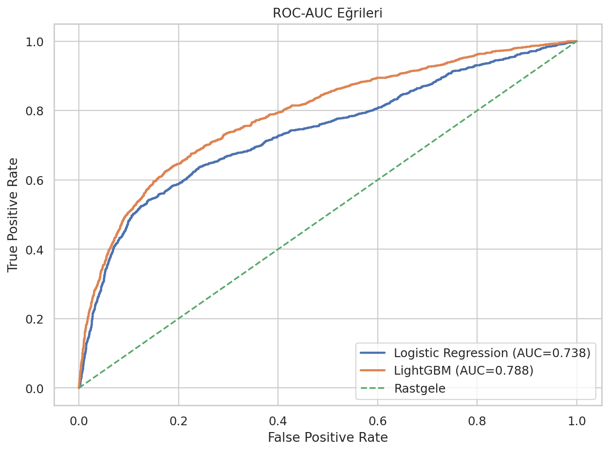
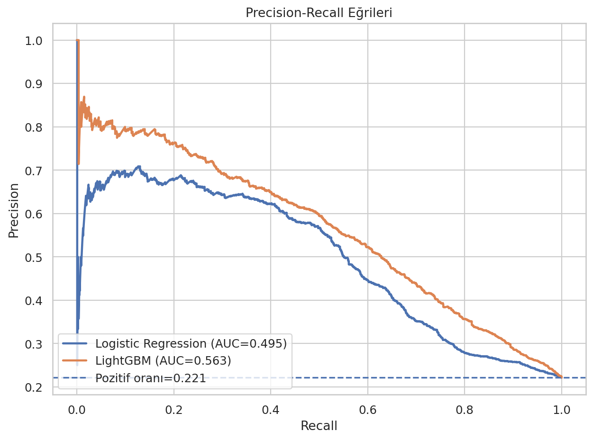
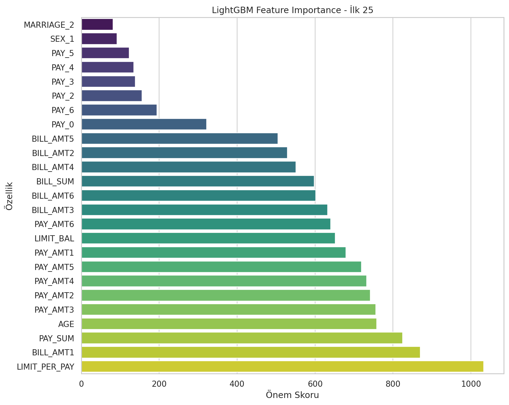
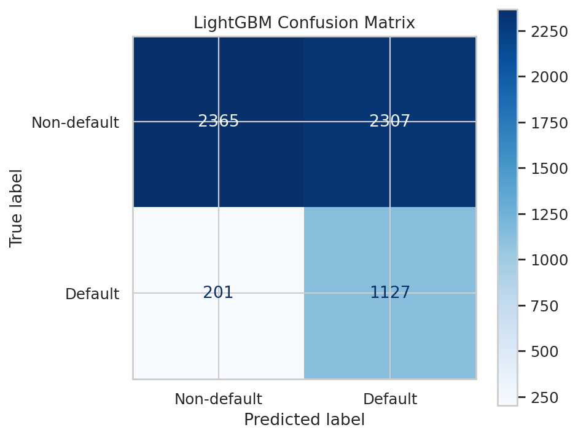

# CrediRisk AI — Kredi Temerrüt Riski Tahmini

[](https://www.python.org/)
[](https://fastapi.tiangolo.com/)
[](https://lightgbm.readthedocs.io/)
[](https://github.com/Blacksidemre/credit-default-risk/actions/workflows/ci.yml)

CrediRisk AI, kredi kartı müşterilerinin bir sonraki ay temerrüde düşme olasılığını tahmin eden uçtan uca bir makine öğrenmesi uygulamasıdır. Proje; veri hazırlama, özellik mühendisliği, model eğitimi, değerlendirme, REST API, web dashboard ve bulut üzerinde yayınlama katmanlarını tek bir yeniden üretilebilir kod tabanında birleştirir.

## Canlı Demo

- **Web dashboard:** https://credit-default-risk-dbuk.onrender.com/
- **API dokümantasyonu:** https://credit-default-risk-dbuk.onrender.com/docs
- **Servis sağlık kontrolü:** https://credit-default-risk-dbuk.onrender.com/health

Web arayüzünde müşteri profili, son altı aylık ödeme durumu, fatura tutarları ve ödeme tutarları girilerek temerrüt olasılığı hesaplanabilir. Sonuç ekranı model olasılığını, karar eşiğini, risk görünümünü ve son altı aylık finansal özeti birlikte sunar.

> Bu repository, UCI *Default of Credit Card Clients* veri seti ile hazırlanmış bir makine öğrenmesi demonstrasyonudur. Gerçek kredi, tahsilat veya benzeri yüksek etkili finansal kararların tek başına bu çıktıya dayanarak verilmesi amaçlanmamıştır.

## Proje Kapsamı

- UCI veri setinin okunması, temizlenmesi ve normalize edilmesi
- Domain odaklı özellik mühendisliği
- Stratified train/test validasyonu
- Logistic Regression baseline modeli
- LightGBM final modeli
- Eğitim verisi üzerinde out-of-fold karar eşiği optimizasyonu
- ROC-AUC, Precision-Recall, Feature Importance ve ek performans görselleri
- Eğitim ve inference için ortak preprocessing pipeline'ı
- FastAPI tabanlı tekli ve toplu tahmin uçları
- Responsive HTML/CSS/JavaScript web dashboard'u
- Pytest ve GitHub Actions ile otomatik testler
- Render için tekrarlanabilir deployment konfigürasyonu

## Model Performansı

Aşağıdaki değerler 6.000 kayıtlık stratified hold-out test setinden elde edilmiştir. LightGBM karar eşiği test setine bakılmadan, yalnızca eğitim bölümündeki 5-fold out-of-fold tahminler kullanılarak F2 skoruna göre seçilmiştir.

| Model | ROC-AUC | Average Precision | Recall | F2 | False Negative Rate |
|---|---:|---:|---:|---:|---:|
| Logistic Regression | 0.738 | 0.496 | 0.654 | 0.581 | 0.346 |
| **LightGBM** | **0.788** | **0.564** | **0.849** | **0.644** | **0.151** |

Final LightGBM karar eşiği: `0.2984427829`

### Değerlendirme Görselleri

| ROC-AUC | Precision-Recall |
|---|---|
|  |  |

| Feature Importance | Confusion Matrix |
|---|---|
|  |  |

Kalibrasyon, sınıf dağılımı ve model karşılaştırma grafikleri [`docs/`](docs/) klasöründe yer alır.

## Veri Seti ve Özellikler

Model, UCI **Default of Credit Card Clients** veri setindeki 30.000 gözlem ile eğitilmiştir. Tahmin sırasında 23 ham özellik kullanılır:

- kredi limiti,
- yaş, cinsiyet, eğitim ve medeni durum,
- son altı aylık ödeme/gecikme statüsü,
- son altı aylık fatura tutarları,
- son altı aylık ödeme tutarları.

Pipeline aşağıdaki dört özelliği otomatik üretir:

- `PAY_SUM` — son altı aylık toplam ödeme
- `BILL_SUM` — son altı aylık toplam fatura
- `LIMIT_PER_PAY` — kredi limitinin toplam ödemeye oranı
- `AGE_BIN` — yaşın kategorik yaş grubuna dönüştürülmüş hali

Ek temizleme adımlarında nadir/özel `EDUCATION` ve `MARRIAGE` kodları normalize edilir. Sayısal alanlara median imputasyon ve standardizasyon, kategorik alanlara uygun imputasyon ve one-hot encoding uygulanır.

Kaynak veri seti: [UCI Machine Learning Repository — Default of Credit Card Clients](https://archive.ics.uci.edu/dataset/350/default+of+credit+card+clients)

## Mimari

```text
Tarayıcı / Harici İstemci
          │
          ▼
   FastAPI Uygulaması
     ├── Dashboard (/)
     ├── Health (/health)
     └── Prediction API (/predict)
          │
          ▼
Feature Engineering + Preprocessing
          │
          ▼
      LightGBM Modeli
          │
          ▼
Olasılık + Sınıflandırma Sonucu
```

Eğitim ve canlı tahmin aynı serialize edilmiş scikit-learn pipeline'ını kullanır. Böylece eğitim ve servis sırasında farklı preprocessing uygulanması riski azaltılır.

## API

| Method | Endpoint | Açıklama |
|---|---|---|
| `GET` | `/` | Web dashboard |
| `GET` | `/api` | Makine tarafından okunabilir servis bilgisi |
| `GET` | `/health` | Uygulama ve model readiness kontrolü |
| `POST` | `/predict` | Tek müşteri tahmini |
| `POST` | `/predict/batch` | En fazla 1.000 kayıtlık toplu tahmin |
| `GET` | `/docs` | Swagger / OpenAPI arayüzü |
| `GET` | `/redoc` | ReDoc API dokümantasyonu |

Örnek istek:

```json
{
  "LIMIT_BAL": 200000,
  "SEX": 2,
  "EDUCATION": 2,
  "MARRIAGE": 1,
  "AGE": 35,
  "PAY_0": 0,
  "PAY_2": 0,
  "PAY_3": 0,
  "PAY_4": 0,
  "PAY_5": 0,
  "PAY_6": 0,
  "BILL_AMT1": 50000,
  "BILL_AMT2": 48000,
  "BILL_AMT3": 47000,
  "BILL_AMT4": 45000,
  "BILL_AMT5": 43000,
  "BILL_AMT6": 42000,
  "PAY_AMT1": 5000,
  "PAY_AMT2": 5000,
  "PAY_AMT3": 5000,
  "PAY_AMT4": 5000,
  "PAY_AMT5": 5000,
  "PAY_AMT6": 5000
}
```

Örnek cevap:

```json
{
  "default_probability": 0.1414947578,
  "prediction": 0,
  "threshold": 0.2984427829,
  "risk_label": "low"
}
```

## Repository Yapısı

```text
credit-default-risk/
├── .github/workflows/ci.yml
├── app.py
├── data/raw/default_of_credit_card_clients.csv
├── docs/
├── examples/sample_request.json
├── models/final_model.pkl
├── notebooks/
├── scripts/render_smoke_test.py
├── src/
│   ├── config.py
│   ├── data_prep.py
│   ├── inference.py
│   ├── pipeline.py
│   ├── train.py
│   └── visualization.py
├── static/
│   ├── app.js
│   └── styles.css
├── templates/index.html
├── tests/
├── .python-version
├── Procfile
├── render.yaml
├── requirements.txt
└── requirements-dev.txt
```

## Yerel Kurulum

Model artifact'ı ve deployment ortamı Python 3.11 ile sabitlenmiştir.

### Windows PowerShell

```powershell
py -3.11 -m venv .venv
.\.venv\Scripts\python.exe -m pip install -r requirements-dev.txt
.\.venv\Scripts\python.exe -m uvicorn app:app --reload
```

### Linux / macOS

```bash
python3.11 -m venv .venv
source .venv/bin/activate
python -m pip install -r requirements-dev.txt
python -m uvicorn app:app --reload
```

Dashboard: `http://127.0.0.1:8000/`  
API dokümantasyonu: `http://127.0.0.1:8000/docs`

## Modeli Yeniden Eğitme

```bash
python -m src.train
```

Eğitim akışı ham veriyi temizler, baseline ve final modeli eğitir, LightGBM karar eşiğini training-only OOF tahminlerinden seçer, test metriklerini üretir, görselleri `docs/` klasörüne kaydeder ve final pipeline'ı `models/final_model.pkl` olarak serialize eder.

## Testler

```bash
python -m pytest
```

GitHub Actions, `main` branch'ine yapılan push ve pull request'lerde test paketini otomatik çalıştırır.

## Render Deployment

Repository kökündeki `render.yaml`, Python sürümünü, build smoke testini, start command'i, health check'i ve auto-deploy davranışını tanımlar.

```yaml
services:
  - type: web
    name: credit-default-risk
    runtime: python
    branch: main
    buildCommand: python -m pip install --upgrade pip && python -m pip install -r requirements.txt && python scripts/render_smoke_test.py
    startCommand: python -m uvicorn app:app --host 0.0.0.0 --port $PORT --workers 1
    healthCheckPath: /health
    renderSubdomainPolicy: enabled
    autoDeployTrigger: commit
```

Mevcut Render servisi için repository `Blacksidemre/credit-default-risk`, branch `main`, Root Directory boş ve runtime `Python 3` olmalıdır. Build ve start komutları yukarıdaki değerlerle eşleşmelidir.

## Sorumlu Kullanım ve Sınırlamalar

- Eğitim verisi kamuya açık tarihsel bir veri setidir; her ülkeyi, müşteri segmentini veya güncel ekonomik koşulları temsil etmez.
- Demo çıktısı kredi tahsisi, tahsilat, hukuki süreç veya başka yüksek etkili finansal kararların tek belirleyicisi olarak kullanılmamalıdır.
- Gerçek kullanımda eşik değerleri hedef kurumun veri dağılımı ve iş maliyetleriyle yeniden kalibre edilmelidir.
- Üretim ortamında model monitoring, drift analizi, açıklanabilirlik, erişim kontrolü, audit log, veri saklama politikaları ve ilgili gizlilik/mevzuat kontrolleri eklenmelidir.
- Kamuya açık demo ekranına hassas veya gerçek müşteri verisi girilmemelidir.
- Kaynak UCI veri seti demografik alanlar içerir. Gerçek finansal kullanımda bu tür alanlar için ayrımcılık/fairness analizi, hukuki inceleme ve kurum politikasına uygun özellik seçimi yapılmalıdır.

## Lisans

Lisans bilgisi için [`LICENSE`](LICENSE) dosyasına bakın.
