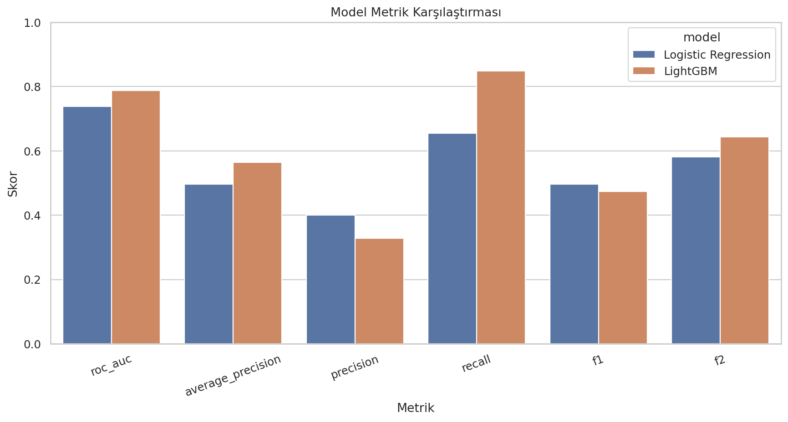

# 🏦 CrediRisk AI — Kredi Temerrüt Riski Tahmin Platformu

> **Yönetici özeti:** CrediRisk AI, bir müşterinin bir sonraki dönemde temerrüde düşme olasılığını tahmin eden, riskli müşterileri daha erken görünür hale getirmeyi amaçlayan uçtan uca bir Makine Öğrenmesi karar-destek uygulamasıdır. Proje; veri hazırlama, modelleme, risk skorlama, görsel dashboard, API ve bulut ortamında yayınlama katmanlarını tek yapıda birleştirir.

---

## 1. Genel Müdür İçin 30 Saniyelik Özet

Bu uygulama, müşteri bilgileri ile son dönem fatura/ödeme davranışlarını kullanarak **temerrüt olasılığı** üretir ve sonucu anlaşılır bir **risk seviyesi** ile gösterir.

Bir Varlık Yönetim Şirketi açısından benzer bir yaklaşım;

- yüksek riskli hesapların daha erken ayrıştırılmasına,
- portföyün risk segmentlerine bölünmesine,
- tahsilat ekiplerinin önceliklendirilmesine,
- manuel inceleme yükünün azaltılmasına,
- kararların veri ile desteklenmesine

yardımcı olabilecek bir analitik altyapının prototipidir.

**Önemli:** Bu çalışma bir **Proof of Concept (PoC) / karar-destek demosudur**. Model, UCI `Default of Credit Card Clients` veri seti ile eğitilmiştir; gerçek bir kurumda otomatik kredi/tahsilat kararı vermeden önce kurumun kendi verisiyle yeniden eğitim, validasyon, kalibrasyon, mevzuat ve model risk yönetimi kontrolleri yapılmalıdır.

---

## 2. Dışarıdan Bir Kullanıcı Nasıl Açar?

### En kolay kullanım: sadece web tarayıcısı

Render üzerinde güncel sürüm deploy edildiğinde kullanıcı herhangi bir kurulum yapmadan şu adresi açar:

**Dashboard:**  
https://credit-default-risk-dbuk.onrender.com/

Kullanıcının bilgisayarında Python, terminal, VS Code veya proje dosyalarının bulunması gerekmez.

### Kullanım akışı

1. Web adresini telefon veya bilgisayar tarayıcısından açın.
2. Müşteri bilgilerini girin.
3. Son 6 aylık ödeme durumu, fatura ve ödeme tutarlarını doldurun.
4. **Tahmin Et / Riski Analiz Et** butonuna basın.
5. Sistem anında:
   - temerrüt olasılığını,
   - risk seviyesini,
   - karar eşiğini,
   - ödeme/fatura özetlerini,
   - 6 aylık finansal davranış grafiğini
   gösterir.

> **Mevcut yayın durumu:** Bu README hazırlanırken public Render adresi `503 Service Unavailable` döndürmektedir. Kod ve Render konfigürasyonu deployment'a hazırdır; dış kullanıcıya gösterimden önce GitHub'daki güncel dashboard sürümünün Render'a yeniden deploy edilmesi gerekir.

---

## 3. Kullanıcının Göreceği Dashboard

Ana sayfa teknik bir API ekranı değildir. Son kullanıcı için hazırlanmış görsel dashboard üzerinde:

- müşteri profili,
- kredi limiti,
- yaş / eğitim / medeni durum bilgileri,
- son 6 aylık ödeme gecikme durumu,
- son 6 aylık fatura tutarları,
- son 6 aylık ödeme tutarları,
- **Temerrüt Olasılığı (%)**,
- **Düşük / Orta / Yüksek Risk** etiketi,
- model karar eşiği,
- `PAY_SUM`, `BILL_SUM`, `LIMIT_PER_PAY` özetleri,
- fatura–ödeme trend grafiği,
- model performans görselleri

tek ekranda sunulur.

Teknik kullanıcılar için Swagger arayüzü ayrıca korunur:

**API Dokümantasyonu:**  
https://credit-default-risk-dbuk.onrender.com/docs

---

## 4. İş Problemi

Temerrüt tahmininde en kritik problemlerden biri **riskli bir müşteriyi risksiz kabul etmektir (False Negative)**. Böyle bir hata, riskin geç fark edilmesine ve aksiyon alınabilecek zamanın kaybedilmesine yol açabilir.

Bu nedenle final model yalnızca genel doğruluk oranını yükseltmeye değil, **temerrüde düşecek müşterileri mümkün olduğunca yakalamaya (Recall)** odaklanacak şekilde eşik optimizasyonu içerir.

### Bu yaklaşımın potansiyel iş kullanım alanları

| Kullanım Alanı | Olası Katkı |
|---|---|
| Risk segmentasyonu | Portföyü düşük / orta / yüksek risk gruplarına ayırma |
| Tahsilat önceliklendirme | Operasyon ekiplerinin riskli hesaplara daha erken odaklanması |
| Erken uyarı | Ödeme davranışındaki bozulmanın skora yansıması |
| Portföy analizi | Risk dağılımının toplu olarak izlenmesi |
| Karar desteği | Manuel değerlendirmeye ek bir veri noktası sağlama |
| Model/API entegrasyonu | CRM, tahsilat veya karar motorlarına servis olarak bağlanabilme |

---

## 5. Model Performansı

Model, **30.000 müşteri kaydı** içeren UCI veri seti üzerinde eğitilmiş ve stratified hold-out test setinde değerlendirilmiştir.

| Model | ROC-AUC | Average Precision | Recall | F2 | False Negative Rate |
|---|---:|---:|---:|---:|---:|
| Logistic Regression | 0.738 | 0.496 | 0.654 | 0.581 | 0.346 |
| **LightGBM (Final)** | **0.788** | **0.564** | **0.849** | **0.644** | **0.151** |

### Yönetici açısından nasıl okunmalı?

- **ROC-AUC = 0.788:** Modelin riskli ve risksiz müşterileri sıralama/ayrıştırma kabiliyetini gösterir.
- **Recall = 0.849:** Test setindeki gerçek temerrüt vakalarının yaklaşık %84.9'u model tarafından riskli olarak yakalanmıştır.
- **False Negative Rate = 0.151:** Gerçek temerrüt vakalarının yaklaşık %15.1'i kaçırılmıştır.
- **F2 = 0.644:** Recall'a precision'dan daha fazla ağırlık veren metrik; bu projedeki “riskli müşteriyi kaçırmama” hedefiyle uyumludur.

Final karar eşiği, test verisine bakılmadan eğitim bölümü üzerinde **5-fold out-of-fold F2 optimizasyonu** ile seçilmiştir:

```text
Threshold = 0.2984427829
```

### Model karşılaştırması



### ROC-AUC


### Precision–Recall


### Feature Importance


---

## 6. Kullanılan Veriler ve Özellikler

Modelin temel girdileri şunlardır:

- kredi limiti (`LIMIT_BAL`),
- yaş,
- eğitim,
- medeni durum,
- cinsiyet,
- son 6 aylık ödeme gecikme statüsü,
- son 6 aylık fatura tutarları,
- son 6 aylık ödeme tutarları.

Bunlara ek olarak model pipeline'ı otomatik olarak dört yeni özellik üretir:

- **`PAY_SUM`** — son 6 ay toplam ödeme,
- **`BILL_SUM`** — son 6 ay toplam fatura,
- **`LIMIT_PER_PAY`** — kredi limitinin toplam ödemeye oranı,
- **`AGE_BIN`** — yaşın kategorik gruba dönüştürülmüş hali.

Eğitimde yapılan preprocessing adımları inference sırasında da aynı pipeline içinde otomatik uygulanır. Böylece eğitim ve canlı tahmin arasında farklı dönüşüm uygulanması riski azaltılır.

---

## 7. Sistem Nasıl Çalışıyor?

```text
Kullanıcı / Kurumsal Sistem
          │
          ▼
   CrediRisk AI Dashboard
          │
          ▼
       FastAPI
          │
          ▼
Preprocessing + Feature Engineering
          │
          ▼
    LightGBM Modeli
          │
          ▼
Temerrüt Olasılığı + Risk Seviyesi
          │
          ▼
Dashboard / JSON API Sonucu
```

Bu mimari sayesinde aynı model hem insan kullanıcının göreceği dashboard üzerinden hem de başka kurumsal yazılımların çağırabileceği REST API üzerinden kullanılabilir.

---

## 8. Varlık Yönetim Şirketi İçin Gerçek Üretim Senaryosuna Geçiş

Bu PoC'nin kurumsal kullanıma dönüşmesi için önerilen yol haritası:

1. **Kurum verisiyle yeniden eğitim:** Gerçek borçlu/müşteri, tahsilat, gecikme, bakiye ve davranış verilerinin kullanılması.
2. **Hedef tanımının netleştirilmesi:** “Temerrüt”, “tahsil edilememe”, “90+ gün gecikme”, “hukuki takip” gibi hedeflerin iş birimiyle açık tanımlanması.
3. **Maliyet bazlı threshold:** Yanlış pozitif ve yanlış negatiflerin TL bazlı maliyetine göre karar eşiğinin optimize edilmesi.
4. **Explainability:** Müşteri bazında skoru hangi değişkenlerin yükselttiğini açıklayan SHAP benzeri açıklanabilirlik katmanı.
5. **Portföy dashboard'u:** Tek müşteri yerine binlerce hesabı toplu risk segmentlerine ayıran yönetim ekranı.
6. **CRM / tahsilat sistemi entegrasyonu:** Skorların mevcut operasyon ekranlarına API üzerinden aktarılması.
7. **Model monitoring:** Veri drift'i, performans düşüşü, default oranı ve segment bazlı metriklerin aylık takibi.
8. **Yetkilendirme ve denetim izi:** Kurumsal kullanıcı girişi, rol bazlı erişim, audit log ve veri erişim politikaları.
9. **Model risk & mevzuat kontrolleri:** Kurum politikaları, KVKK, bilgi güvenliği ve ilgili finansal düzenlemeler kapsamında inceleme.

---

## 9. Veri Güvenliği Notu

Mevcut demo uygulamasında kalıcı bir müşteri veritabanına kayıt mekanizması bulunmamaktadır; kullanıcı girdisi tahmin için API'ye gönderilir ve model sonucu döndürülür.

Bununla birlikte gerçek müşteri verisiyle üretim kullanımına geçmeden önce mutlaka:

- kimlik doğrulama,
- rol bazlı yetkilendirme,
- TLS/HTTPS,
- log maskeleme,
- veri saklama politikası,
- KVKK uyumu,
- ağ ve uygulama güvenliği

kurumsal standartlara göre tasarlanmalıdır.

---

## 10. Teknik Mimari

Proje aşağıdaki bileşenlerden oluşur:

- **Python 3.11**
- **pandas / NumPy** — veri işleme
- **scikit-learn** — preprocessing, Logistic Regression ve pipeline
- **LightGBM** — final gradient boosting modeli
- **FastAPI** — REST API
- **Jinja2 + HTML/CSS/JavaScript** — kullanıcı dashboard'u
- **joblib** — model artifact yönetimi
- **Matplotlib / Seaborn** — model görselleştirmeleri
- **pytest** — otomatik testler
- **Render** — web deployment

---

## 11. API Endpoint'leri

| Method | Endpoint | Açıklama |
|---|---|---|
| `GET` | `/` | Son kullanıcı CrediRisk AI dashboard'u |
| `GET` | `/api` | Servis bilgisi |
| `GET` | `/health` | Model ve servis sağlık kontrolü |
| `POST` | `/predict` | Tek müşteri için risk tahmini |
| `POST` | `/predict/batch` | En fazla 1000 müşteri için toplu tahmin |
| `GET` | `/docs` | Swagger API arayüzü |
| `GET` | `/redoc` | Alternatif API dokümantasyonu |

---

## 12. Proje Klasör Yapısı

```text
credit-default-risk-final/
├── app.py                    # FastAPI + dashboard giriş noktası
├── templates/
│   └── index.html            # Web dashboard
├── static/
│   ├── styles.css            # Dashboard tasarımı
│   └── app.js                # Form, tahmin ve grafik etkileşimleri
├── models/
│   └── final_model.pkl       # Eğitilmiş LightGBM pipeline
├── src/
│   ├── config.py
│   ├── data_prep.py
│   ├── pipeline.py
│   ├── visualization.py
│   ├── train.py
│   └── inference.py
├── docs/
│   ├── metrics.json
│   ├── roc_auc_curve.png
│   ├── precision_recall_curve.png
│   ├── feature_importance.png
│   ├── confusion_matrix.png
│   ├── calibration_curve.png
│   └── model_metric_comparison.png
├── tests/
├── render.yaml
├── Procfile
└── requirements.txt
```

---

# Teknik Ek

## 13. Windows'ta Yerel Çalıştırma

Dış kullanıcı için bu adımlar gerekmez. Yalnızca geliştirici veya demo bilgisayarında lokal çalıştırmak için kullanılır.

### Python 3.11 sanal ortamı

```powershell
py -3.11 -m venv .venv
```

### Paket kurulumu

```powershell
.\.venv\Scripts\python.exe -m pip install -r requirements.txt
```

### Sunucuyu başlatma

```powershell
.\.venv\Scripts\python.exe -m uvicorn app:app --reload
```

Tarayıcı:

```text
http://127.0.0.1:8000/
```

Swagger:

```text
http://127.0.0.1:8000/docs
```

---

## 14. Modeli Yeniden Eğitme

```powershell
.\.venv\Scripts\python.exe -m src.train
```

Bu işlem:

1. veriyi temizler,
2. özellik mühendisliği yapar,
3. stratified train/test bölmesini oluşturur,
4. Logistic Regression baseline modelini eğitir,
5. LightGBM threshold optimizasyonunu gerçekleştirir,
6. test metriklerini hesaplar,
7. grafikleri `docs/` içine kaydeder,
8. final pipeline'ı `models/final_model.pkl` olarak kaydeder.

---

## 15. Otomatik Testler

```powershell
.\.venv\Scripts\python.exe -m pytest
```

Beklenen mevcut sonuç:

```text
5 passed
```

---

## 16. Render Deployment

Repository içinde hazır `render.yaml` bulunur:

```yaml
services:
  - type: web
    name: credit-default-risk
    runtime: python
    plan: free
    buildCommand: pip install -r requirements.txt
    startCommand: uvicorn app:app --host 0.0.0.0 --port $PORT
    healthCheckPath: /health
    autoDeploy: true
```

Render ayarları:

- **Build Command:** `pip install -r requirements.txt`
- **Start Command:** `uvicorn app:app --host 0.0.0.0 --port $PORT`
- **Health Check Path:** `/health`
- **Branch:** `main`
- **Python:** `.python-version` ile `3.11.11`

Deploy tamamlandıktan sonra dış kullanıcı yalnızca verilen HTTPS adresini açar.

---

## 17. Sonuç

CrediRisk AI, kredi risk modellemesinin yalnızca notebook seviyesinde kalmadığını; **veriden modele, modelden API'ye ve son kullanıcı dashboard'una kadar uçtan uca ürünleştirilebildiğini** gösteren bir PoC'dir.

Varlık yönetimi perspektifinde projenin asıl değeri, aynı yaklaşımın kurumun kendi portföy ve tahsilat verisiyle yeniden eğitilerek **erken uyarı, risk segmentasyonu ve operasyon önceliklendirme** mekanizmasına dönüştürülebilmesidir.

---

**Proje:** Kredi Kartı Temerrüt Riski Tahmini / CrediRisk AI  
**Model:** LightGBM  
**Deployment:** FastAPI + Render  
**Durum:** PoC / Demo — kurumsal üretim kullanımı öncesi kurum verisiyle validasyon gerektirir.

---

## 14. GitHub'a Tek Komutla Yayınlama (Windows)

Bu paket, mevcut GitHub reposunun üzerine güvenli biçimde yayın yapmak için iki yardımcı dosya içerir:

- `publish_to_github.bat`
- `publish_to_github.ps1`

Windows'ta en kolay yöntem `publish_to_github.bat` dosyasına çift tıklamaktır. Script:

1. `https://github.com/Blacksidemre/credit-default-risk` reposunu geçici klasöre klonlar.
2. Mevcut `main` sürümünü tarih-saat içeren bir `backup/pre-dashboard-*` branch'i olarak GitHub'a gönderir.
3. Güncel CrediRisk AI dashboard, FastAPI, model pipeline, testler, dokümantasyon ve Render dosyalarını repo ile senkronize eder.
4. Eski `docs/placeholders` ve `src/__pycache__` artıklarını temizler.
5. Değişiklikleri commit edip `main` branch'e push eder.
6. Render servisi repo ile bağlı ve Auto Deploy açıksa deployment otomatik başlar.

> Script `data/` klasörünü kopyalama sırasında özellikle hariç tutar. Böylece GitHub reposundaki mevcut `data/raw/default_of_credit_card_clients.csv` korunur.

Komut satırından çalıştırmak isterseniz:

```powershell
powershell -ExecutionPolicy Bypass -File .\publish_to_github.ps1
```

GitHub kimlik doğrulama penceresi açılırsa `Blacksidemre` hesabınızla giriş yapmanız yeterlidir. Şifre veya erişim token'ını proje dosyasına yazmayın.
